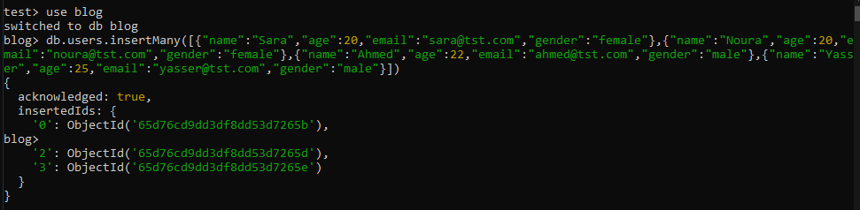
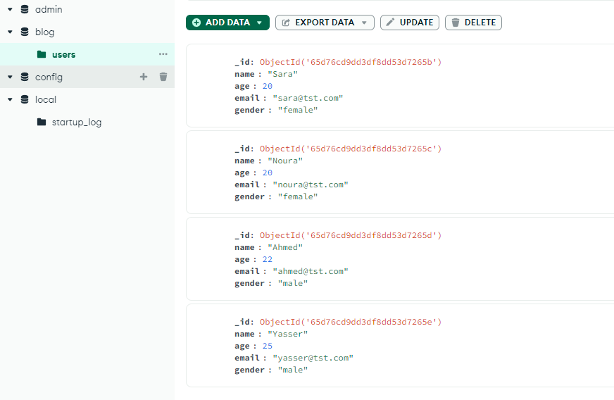
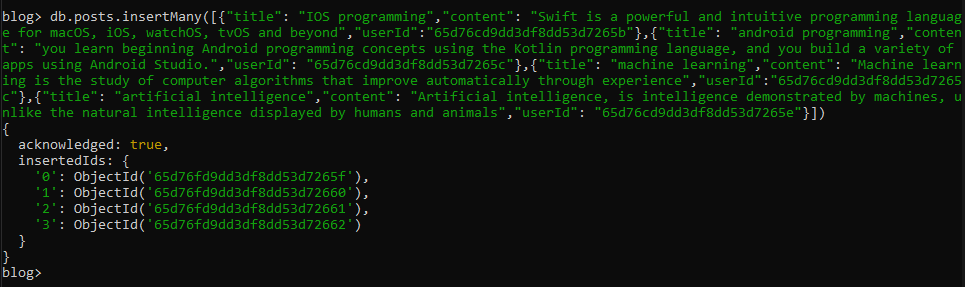
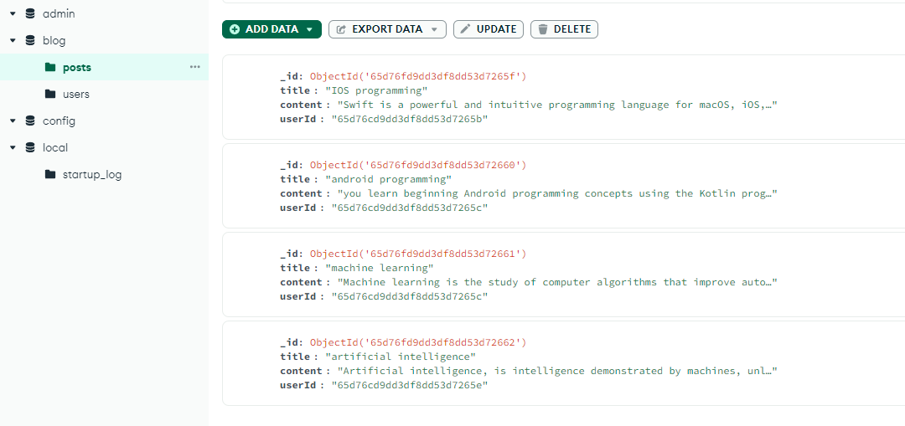
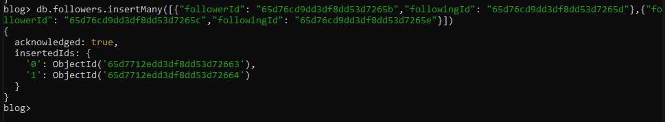
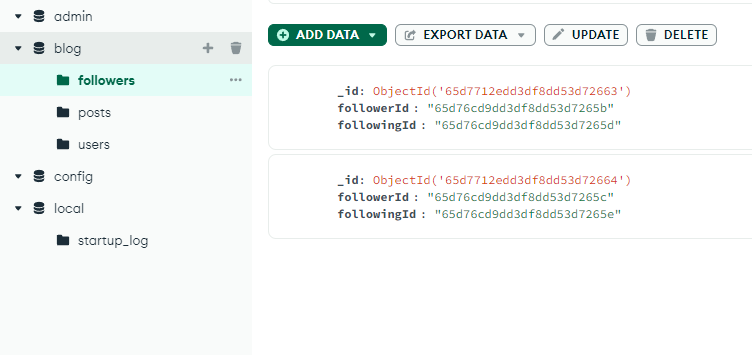
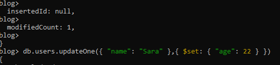
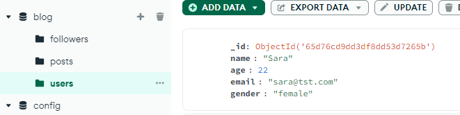
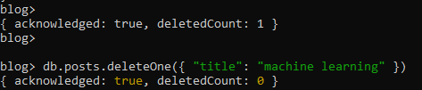
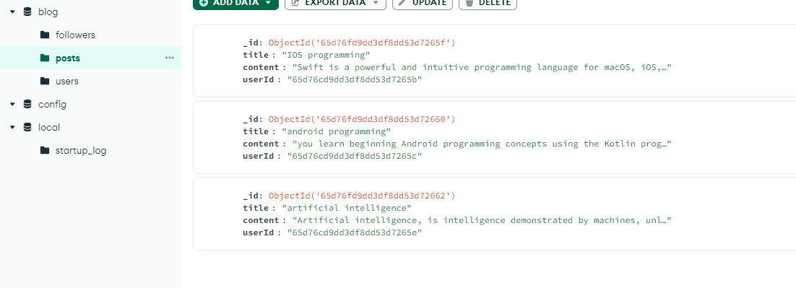

# Final project for MongoDB course from Satr

At the end of this course, we want you to complete a small project to test your understanding.

#### Assumptions:

    A blogging system that includes users who can:
        Add posts
        Add comments to other users' posts
        Follow each other

#### Requirements:

    Create a database named blog that contains three collections:
        users: For system users
        posts: For user posts
        followers: For follow relationships between users

<br><br>

### Populate the data in the three collections according to the following data:

| gender | email | age | name |
|-----|--------|-----|--------|
|female|sara@tst.com|20|Sara|
|female|noura@tst.com|20|Noura|
|male|ahmed@tst.com|22|Ahmed|
|male|yasser@tst.com|25|Yasser|

<br><br>

```SQL
//create db

use blog
```

```SQL
//users collection

db.users.insertMany([
  {
    "name": "Sara",
    "age": 20,
    "email": "sara@tst.com",
    "gender": "female"
  },
  {
    "name": "Noura",
    "age": 20,
    "email": "noura@tst.com",
    "gender": "female"
  },
  {
    "name": "Ahmed",
    "age": 22,
    "email": "ahmed@tst.com",
    "gender": "male"
  },
  {
    "name": "Yasser",
    "age": 25,
    "email": "yasser@tst.com",
    "gender": "male"
  }
])

```
## Output:



### posts collection:

#### Assumptions:
    User Sara posted IOS programming
    User Noura published android programming and machine learning
    User Yasser posted artificial intelligence

#### Instructions:
    Now we take the ID of the user who wrote each post by copying the user ID that appeared in the output previously when adding the user and then putting it in the userId field.


<br><br>

| userId | content | title |
|-----|--------|-----|
|Sara ID|Swift is a powerful and intuitive programming language for macOS, iOS, watchOS, tvOS and beyond.|IOS programming|
|Noura ID|you learn beginning Android programming concepts using the Kotlin programming language, and you build a variety of apps using Android Studio.|android programming|
|Noura ID|Machine learning is the study of computer algorithms that improve automatically through experience.|machine learning|
|Yasser|Artificial intelligence, is intelligence demonstrated by machines, unlike the natural intelligence displayed by humans and animals.|artificial intelligence|

<br><br>

```SQL
//posts collection 

db.posts.insertMany([
  {
    "title": "IOS programming",
    "content": "Swift is a powerful and intuitive programming language for macOS, iOS, watchOS, tvOS and beyond",
    "userId": "<user_id of Sara>"
  },
  {
    "title": "android programming",
    "content": "you learn beginning Android programming concepts using the Kotlin programming language, and you build a variety of apps using Android Studio.",
    "userId": "<user_id of Noura>"
  },
  {
    "title": "machine learning",
    "content": "Machine learning is the study of computer algorithms that improve automatically through experience",
    "userId": "<user_id of Noura>"
  },
  {
    "title": "artificial intelligence",
    "content": "Artificial intelligence, is intelligence demonstrated by machines, unlike the natural intelligence displayed by humans and animals",
    "userId": "<user_id of Yasser>"
  }
])
```
## Output:



<br><br>

### Now, after filling in the data for the two collections, we want you to create a third collection called Followers, specify the necessary fields and fill them out

```SQL
//followers collection
db.followers.insertMany([
  {
    "followerId": "<user_id of Sara>",
    "followingId": "<user_id of Ahmed>"
  },
  {
    "followerId": "<user_id of Noura>",
    "followingId": "<user_id of Yasser>"
  }
])
```
## Output:



<br><br>

#### Finally, perform the following requirements on what was previously created and filled out

    A.Change the age of user Sara to 22

    B.Delete the post machine learning

<br>

#### A.
```SQL
db.users.updateOne(
  { "name": "Sara" },
  { $set: { "age": 22 } }
)
```
## Output:



<br>

B.
```SQL
db.posts.deleteOne(
  { "title": "machine learning" }
)
```
## Output:



